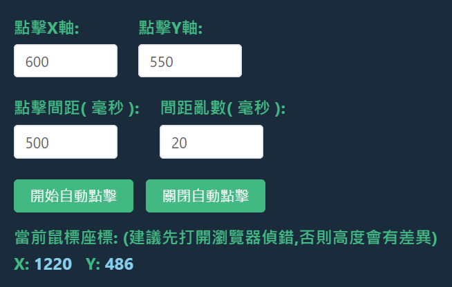
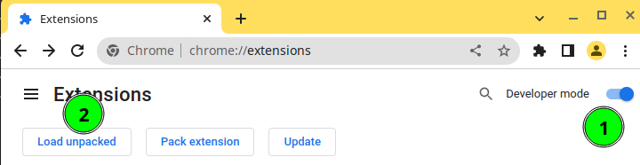

<div align="center">


</div>

# Pixels 鏈遊輔助插件

遊戲連結:  
https://play.pixels.xyz/

插件下載連結:  
https://drive.google.com/drive/folders/19O8_KQe5kVQJdtuLwuVyvPzNoKdL3u6O

專案針對 Pixels 區塊鏈遊戲開發 Chrome 輔助插件,  
利用 Vue3 開發插件介面,  
並利用 NodeJS 紀錄玩家的存檔

## 插件功能

- 計時器功能  
  此遊戲種植或是能量都需要時間倒數,  
  除了幾個基本的計時器,使用者也能自行添加計時器.
  

- 自動料理  
  此遊戲料理可能每幾分鐘要手動按下製作按鈕,  
  此插件每 0.5 秒 會幫玩家自動按下料理按鈕,  
  並且當料理結束時插件會發出提示音.  
  

- 點擊助手  
  此插件可以隨時偵測用戶鼠標 X Y 座標,  
  用戶可以手動填入 X Y 位子,  
  讓腳本根據 X Y 位子做連動的動作.
  

- 任務截圖  
  當玩家打開遊戲任務列表時,  
  插件會自動對遊戲畫面做截圖,  
  並且顯示到插件畫面中,  
  這樣玩家就不會忘記今天的任務是甚麼.  
  

- 雲端存檔  
  以上功能皆有雲端存檔紀錄的功能,  
  不用註冊只需要記住存檔代號,  
  就能跨裝置讀取插件紀錄.  
  

- 購買助手 (官方更新後已失效)  
  可以自動購買玩家指定的物品,  
  並且根據購買的狀態,  
  來得知此次購買為成功或是失敗

## 插件安裝教學

1. 下載最新版本壓縮檔  
   插件下載連結:  
   https://drive.google.com/drive/folders/19O8_KQe5kVQJdtuLwuVyvPzNoKdL3u6O

2. 解壓縮檔案

3. Chrome 打開擴充插件選單  
   Chrome 網址貼上

   ```
   chrome://extensions/
   ```

4. 安裝插件  
   

   1. 打開 開發人員模式
   2. 點擊 載入未封裝項目
   3. 選擇解壓縮後的插件目錄

5. 開始使用
   
   記得開啟新的 ChromeTab,  
   可以把 PixelsGame 標籤拖曳到最前面方便使用.

## 本地開發流程

0. NodeJS 版本 v18.17.1
1. 輸入 `npm install`.
2. Run `npm run start` 來運行開發.
3. 運行完成後會產生 `dist` 目錄, 接著如下圖.

   1. 網址輸入 `chrome://extensions`
   2. 打開 `開發人員模式`
   3. 選擇 `載入未封裝項目` 並且選擇 `dist` 目錄
      

4. 完成

## 本地打包流程

0. `npm run build`
1. `本地會產生prod`
2. 運行完成後會產生 `prod` 目錄, 接著如下圖.
   1. 網址輸入 `chrome://extensions`
   2. 打開 `開發人員模式`
   3. 選擇 `載入未封裝項目` 並且選擇 `prod` 目錄
      
3. 完成
